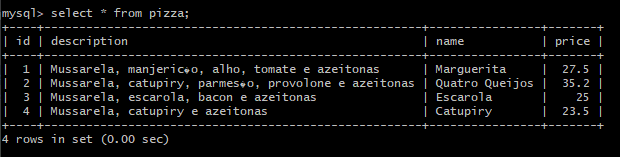
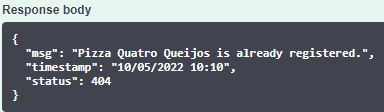
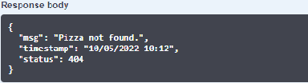
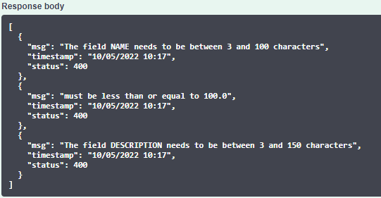
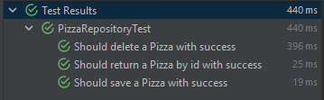
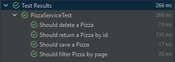
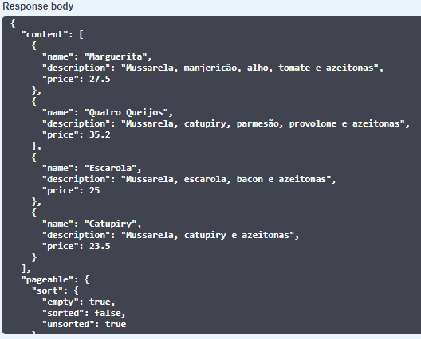

# Teste técnico - CI&T

---

### Status
>Concluído ✔️

---

### Tecnologias

* Java 11
* Spring Boot 2.6.7
* Spring Data JPA
* Docker
* Maven
* MySQL
* H2 Database
* JUnit
* Mockito
* Swagger

---

### Como utilizar a aplicação?

* 1- Clone o projeto para o diretório desejado
* 2- Abra um terminal (git bash, de preferência) na raiz do projeto
* 3- Execute os seguintes comandos:
```
mvn clean install
mvn clean package
docker-compose up -d
```

* 4- Rode a aplicação com o IntelliJ
* 5- Acesse os endpoints da aplicação, via swagger: http://localhost:8080/swagger-ui/#/

---

### Acesso à tabela do banco de dados

Como o ambiente da aplicação sobe via docker-compose, o MySQL é um contêiner, e para acessar a tabela `pizza`, deve-se executar, na raiz do projeto, os seguintes comandos:

**IMPORTANTE**: Caso esteja utilizando o Git Bash, substitua o primeiro comando por `winpty docker exec -it mysql mysql -uroot -proot`

```
docker exec -it mysql mysql -uroot -proot
use db_testect;
select * from pizza;
```



---

### Features

* **Exceções personalizadas**: O código foi programado para lançar exceções descritivas, que auxiliam o programador a encontrar a origem do problema.





* **Lista de exceções referentes à validação**: Ao tentar realizar a entrada de dados incompletos/incorretos, o sistema retorna uma lista de exceções personalizadas.




--- 

### Diferenciais implementados no projeto

✔️ Documentação da API com Swagger

✔️ Acesso ao banco de dados via docker-compose

✔️ Testes unitários com JUnit: Com o objetivo de manter a integridade das funções, realizei alguns testes nas seguintes camadas: **repository** e **servcice**





✔️ Paginação de endpoint para a listagem das pizzas cadastradas



